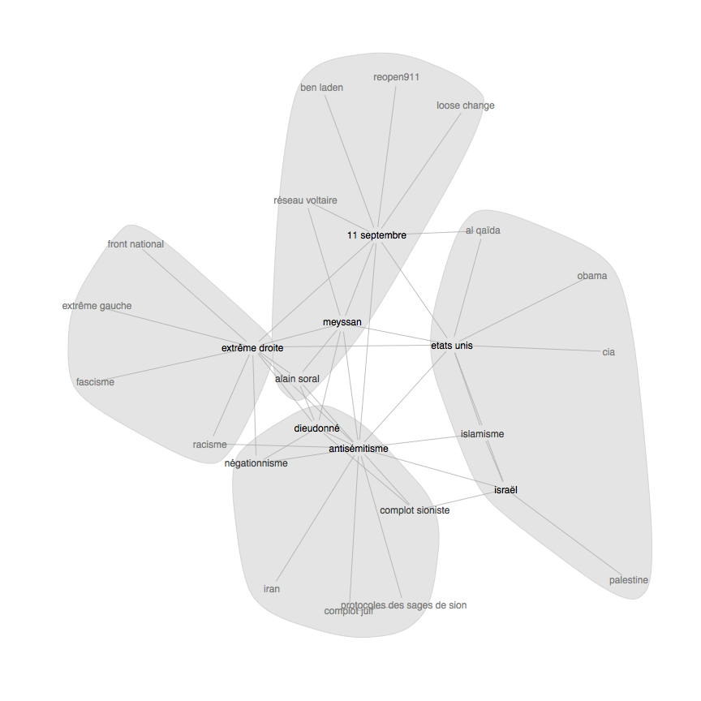

R code to scrape the keywords from three blogs dedicated to the study of French conspiracy theorists. See [this note](http://www.jean-jaures.org/Publications/Notes/Conspirationnisme-un-etat-des-lieux) and [this note]() for more detailed analysis of the same topic.

Sources:

- [Confusionnisme](http://confusionnisme.info/)
- [Conspiracy Watch](http://www.conspiracywatch.info/)
- [Conspis hors de nos vi[ll]es](http://conspishorsdenosvies.noblogs.org/)

